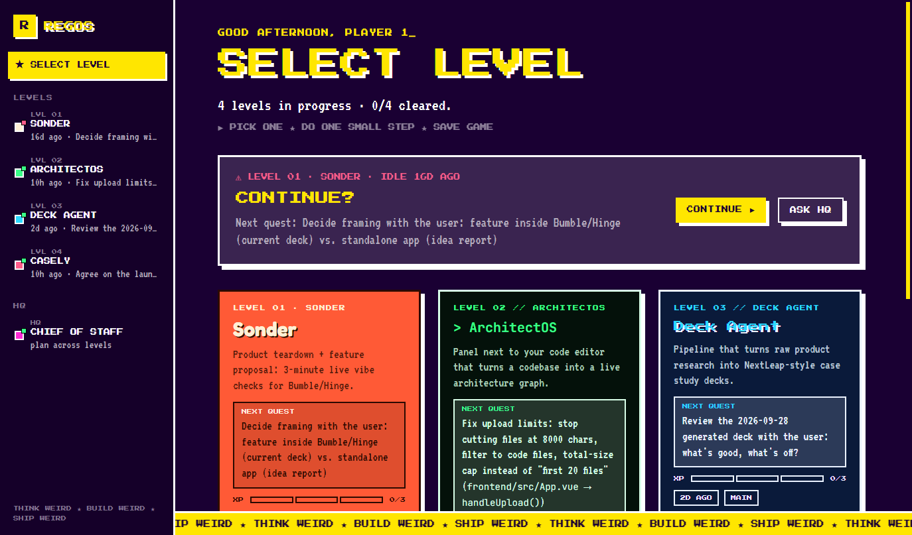
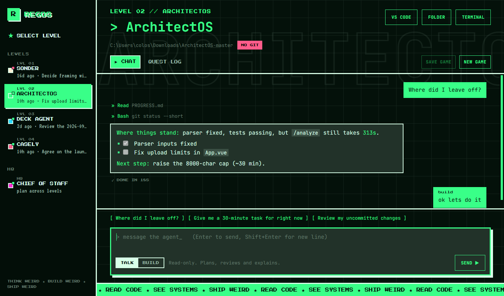
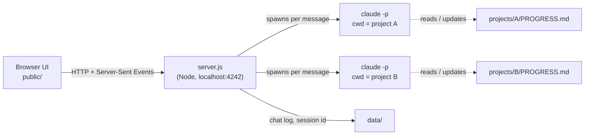

# REGOS

**One AI agent per project, in one retro dashboard.** REGOS is a local web app where each of my side projects has its own [Claude Code](https://claude.com/claude-code) agent. Each agent knows its project, remembers where I left off, and keeps me moving one small step at a time.

> THINK WEIRD ★ BUILD WEIRD ★ SHIP WEIRD



## Why I built this

I had too many projects going at once and none of them moving. Every time I opened one, I spent the first 30 minutes working out where I'd stopped, and usually quit before shipping anything.

REGOS treats each project as a **level** in a game:

- **Each level has its own agent.** It works inside that project's folder, reads the code, and can plan, review or build.
- **Each agent keeps a quest log** (`PROGRESS.md`) with the goal, current status, next steps and a dated log. It reads the log at the start of every conversation, so I never begin from zero.
- **The home screen shows every level at a glance:** next quest, XP bar, days since last touched, and git warnings. It highlights the level I've neglected longest.
- **A Chief of Staff agent looks across all levels** and helps me choose *one* thing to do today. It pushes back when I try to start something new.


<sub>Example conversation with the ArchitectOS agent.</sub>

## Features

- **An agent for each project.** Each one is Claude Code running headless in the project's folder, with its own ongoing conversation. Several agents can work at the same time.
- **Talk and Build modes.**
  - **Talk** is read-only: plan, review and explain.
  - **Build** can edit files and run common dev commands (npm, node, python, git status/diff/add).
  - `git push`, `rm -rf`, `git reset --hard` and `git clean` are always blocked.
- **SAVE GAME.** One click and the agent rewrites its `PROGRESS.md` from the conversation, keeping a backup of the previous version. You can also edit the quest log by hand in the app.
- **Terminal handoff.** Continue the same conversation in an interactive Claude Code session in Windows Terminal, with full permission prompts.
- **Quick actions:** open the project in VS Code or Explorer, and see live git status (branch, uncommitted files, unpushed commits, or no git at all).
- **Per-level themes.** Every project has its own palette, fonts and marquee, matching the sections of my [portfolio](https://github.com/nidhishh).
- **No API key needed.** Agents run on your existing Claude subscription through the Claude Code CLI.
- **Zero dependencies:** plain Node.js on the backend and vanilla HTML, CSS and JS on the frontend. No build step.

## How it works



1. When you send a message, `server.js` runs `claude -p --output-format stream-json --resume <session>` inside that project's folder.
2. The agent's system prompt is built from [`agents/`](agents/): a shared base, a guide for the project type (`code`, `pm` or `hq`) and the current mode.
3. Tool permissions come from the mode. Talk uses read-only tools. Build uses `acceptEdits` plus an allowlist of dev commands.
4. The CLI's streamed events (text, tool calls, results, blocked actions) are saved to `data/<id>/chat.jsonl` and pushed to the browser live.
5. **SAVE GAME** asks the agent for an updated `PROGRESS.md`. The server backs up the old file and writes the new one.

## Getting started

### Requirements

- **Windows 10/11.** The "Terminal", "VS Code" and "Folder" buttons use Windows tools. The chat itself is cross-platform Node.
- **Node.js 20+**
- **[Claude Code](https://docs.claude.com/en/docs/claude-code) CLI**, installed and logged in. Check that `claude --version` works in a terminal.
- **Git** (optional), for the git status badges.

### Run

```bash
git clone https://github.com/nidhishh/REGOS.git
cd REGOS
npm start          # or double-click start.cmd
```

REGOS opens at **http://localhost:4242**. It only listens on `127.0.0.1`, so it isn't reachable from other machines.

### Add your projects

Edit [`projects.json`](projects.json):

```json
{
  "id": "my-app",
  "name": "My App",
  "level": 1,
  "type": "code",
  "path": "C:\\path\\to\\my-app",
  "blurb": "One line on what it is.",
  "theme": { "bg": "#0a1a3a", "fg": "#eaf2ff", "acc": "#2bd9ff", "band": "BUILD ★ SHIP ★ REPEAT ★" }
}
```

| Field | Meaning |
|---|---|
| `type` | `code` for software projects, `pm` for product and case-study work, `hq` for the Chief of Staff |
| `level` | Order on the select-level screen |
| `theme` | `bg`, `fg` and `acc` colors. Optional `style`: `so` (rounded Fredoka) or `ar` (terminal/grid). `band` is the marquee text |

Then create `projects/<id>/PROGRESS.md`. Start from this template:

```markdown
# My App — Progress

## Goal
What "done" looks like for the next milestone.

## Status
_Updated YYYY-MM-DD_
- Where things stand.

## Next steps
- [ ] Small step (20–60 min)
- [ ] Next small step

## Blockers / open questions
- ...

## Log
- YYYY-MM-DD: What happened.
```

The dashboard reads the **Next steps** checkboxes for the "next quest" and the XP bar.

To give one agent extra instructions, add them to `projects/<id>/AGENT.md`.

## Project structure

```
REGOS/
├── server.js          # HTTP server, agent runner, git/activity status
├── projects.json      # project registry + per-level themes
├── agents/            # system prompt templates (base, code, pm, hq, modes)
├── projects/<id>/     # PROGRESS.md (+ optional AGENT.md) per project — gitignored
├── public/            # index.html, app.js, styles.css
├── data/              # chat logs, session ids, backups — gitignored
└── start.cmd          # double-click launcher
```

Progress files and chat logs are gitignored on purpose. They're personal notes and stay on your machine.

## Safety notes

- Build mode lets an agent edit files in the project folder. Use it on projects under git, so every change can be reviewed and undone. The UI warns you when a project has no git.
- Anything that isn't allowed in the current mode is blocked and shown in the chat, not silently run.
- If you need a command that's blocked, use **Terminal** to get an interactive session where you approve each action.

## Roadmap

- [ ] Daily check-in nudges for neglected levels
- [ ] Multiple agents per project (for example a PM agent and a builder agent)
- [ ] One-click "safety commit" for projects with lots of uncommitted work
- [ ] Add and edit projects from the UI instead of `projects.json`

## Built with

- [Claude Code](https://claude.com/claude-code) (headless mode) for the agents
- Node.js standard library for the server
- [marked](https://marked.js.org/) and [DOMPurify](https://github.com/cure53/DOMPurify) for rendering Markdown
- Press Start 2P, VT323, Fredoka and JetBrains Mono fonts

---

Made by [Nidhish Javvadi](https://www.linkedin.com/in/nidhish-javvadi-85b671265/). Think weird ★ build weird ★ ship weird.
